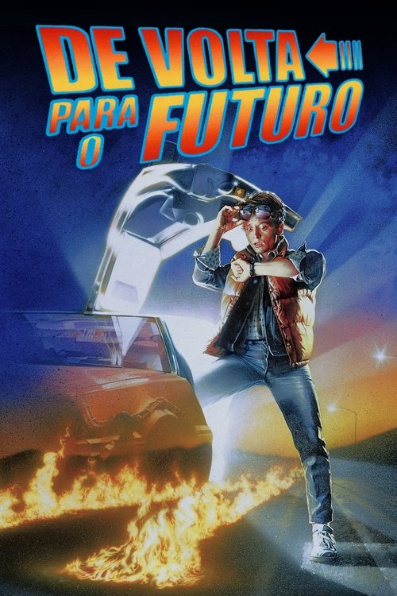

# Hi! I'm Pedro! ☕✨

<table>
  <tr>
    <td valign="top" width="58%">

Hi! My name is **Pedro Vitor**  
and chat with me here:

I am passionate about technology, data intelligence, machine learning, and creative media. Currently studying **Data Science & Artificial Intelligence**, exploring Machine Learning, Deep Learning, and Computer Vision to turn complex data into smart, actionable solutions. Using...

 

  
  
  
  
  
  
  
  
  
  
  
  
  
  
  
  
  
  
  
  
  
  
  
  

  </td>
  <td valign="middle" align="center" width="42%">
    
  </td>
</tr>
</table>

---

###  Top 4 Filmes Favoritos (Letterboxd)

<table>
  <tr>
    <td align="center" width="25%">
      <a href="https://letterboxd.com/pedroogrande/film/django-unchained/">
         
        <b>Django Livre</b>
      </a>
    </td>
    <td align="center" width="25%">
      <a href="https://letterboxd.com/pedroogrande/film/back-to-the-future/">
         
        <b>De Volta p/ o Futuro</b>
      </a>
    </td>
    <td align="center" width="25%">
      <a href="https://letterboxd.com/pedroogrande/film/50-first-dates/">
         
        <b>Como Se Fosse a 1ª Vez</b>
      </a>
    </td>
    <td align="center" width="25%">
      <a href="https://letterboxd.com/pedroogrande/film/past-lives/">
         
        <b>Vidas Passadas</b>
      </a>
    </td>
  </tr>
</table>

---

*"Os sonhos das pessoas não têm fim"*

