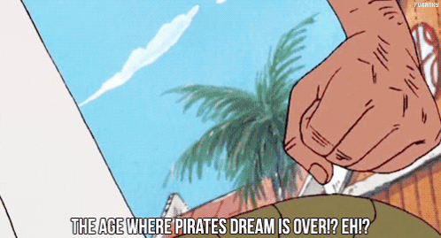

## Olá, my name is 👋

  
# 🕹️ Pedro Vitor

### `Data Science | IA | Cinéfilo | Nerd`

---

## 👨‍💻 Sobre

🎯 Estudante de **Ciência de Dados e Inteligência Artificial**  
📍 Goiânia, GO  
☕ Café + Código + Música = Flow  

💡 Documentando minha jornada de aprendizado um commit por vez

---

## 🎬 Hobbies

- 🎵 **Música**  
- 🎬 **Cinema**   
- 📚 **Quadrinhos**  
- 🎌 **Anime**

---

## � Tecnologias

---

<h2>📊 GitHub Stats</h2>

---

## 📡 Links

---

*"Os sonhos das pessoas não têm fim"*

